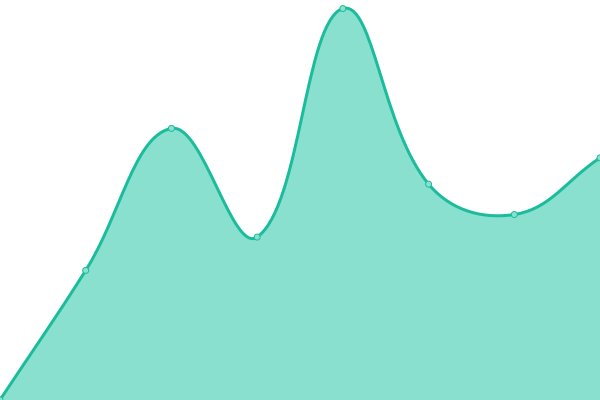
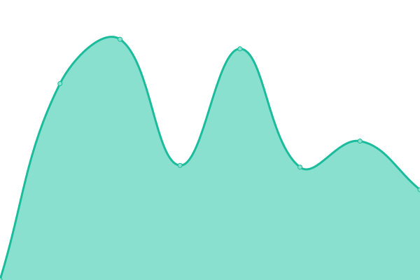
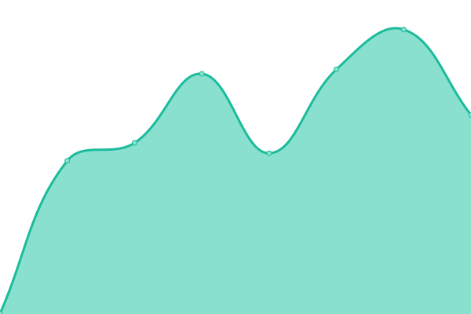

# [📈 Live Status](https://JensKriegerJuhnke.github.io/luhup): <!--live status--> **🟩 All systems operational**

This repository contains the open-source uptime monitor and status page for [Jens Krieger-Juhnke](https://JensKriegerJuhnke.github.io/luhup), powered by [Upptime](https://github.com/upptime/upptime).

With [Upptime](https://upptime.js.org), you can get your own unlimited and free uptime monitor and status page, powered entirely by a GitHub repository. We use [Issues](https://github.com/JensKriegerJuhnke/luhup/issues) as incident reports, [Actions](https://github.com/JensKriegerJuhnke/luhup/actions) as uptime monitors, and [Pages](https://JensKriegerJuhnke.github.io/luhup) for the status page.

<!--start: status pages-->
<!-- This summary is generated by Upptime (https://github.com/upptime/upptime) -->
<!-- Do not edit this manually, your changes will be overwritten -->
<!-- prettier-ignore -->
| URL | Status | History | Response Time | Uptime |
| --- | ------ | ------- | ------------- | ------ |
|  [StudIP](https://studip.uni-hannover.de) | 🟩 Up | [stud-ip.yml](https://github.com/JensKriegerJuhnke/luhup/commits/HEAD/history/stud-ip.yml) | 

 2129ms
     
 | 

<a href="https://JensKriegerJuhnke.github.io/luhup/history/stud-ip">100.00%</a>
    

|  [WebSSO](https://sso.idm.uni-hannover.de) | 🟩 Up | [web-sso.yml](https://github.com/JensKriegerJuhnke/luhup/commits/HEAD/history/web-sso.yml) | 

 902ms
     
 | 

<a href="https://JensKriegerJuhnke.github.io/luhup/history/web-sso">100.00%</a>
    

|  [IDM](https://login.uni-hannover.de) | 🟩 Up | [idm.yml](https://github.com/JensKriegerJuhnke/luhup/commits/HEAD/history/idm.yml) | 

 1539ms
     
 | 

<a href="https://JensKriegerJuhnke.github.io/luhup/history/idm">100.00%</a>
    

|  [Gitlab](https://gitlab.uni-hannover.de) | 🟩 Up | [gitlab.yml](https://github.com/JensKriegerJuhnke/luhup/commits/HEAD/history/gitlab.yml) | 

 5963ms
     
 | 

<a href="https://JensKriegerJuhnke.github.io/luhup/history/gitlab">100.00%</a>
    

|  [FINF](https://finf.uni-hannover.de) | 🟩 Up | [finf.yml](https://github.com/JensKriegerJuhnke/luhup/commits/HEAD/history/finf.yml) | 

 2265ms
     
 | 

<a href="https://JensKriegerJuhnke.github.io/luhup/history/finf">100.00%</a>
    

|  [HCI Abgaben](https://assignments.hci.uni-hannover.de) | 🟩 Up | [hci-abgaben.yml](https://github.com/JensKriegerJuhnke/luhup/commits/HEAD/history/hci-abgaben.yml) | 

 719ms
     
 | 

<a href="https://JensKriegerJuhnke.github.io/luhup/history/hci-abgaben">100.00%</a>
    

|  [QIS](https://qis.verwaltung.uni-hannover.de) | 🟩 Up | [qis.yml](https://github.com/JensKriegerJuhnke/luhup/commits/HEAD/history/qis.yml) | 

 817ms
     
 | 

<a href="https://JensKriegerJuhnke.github.io/luhup/history/qis">100.00%</a>
    

|  [ILIAS](https://ilias.uni-hannover.de) | 🟩 Up | [ilias.yml](https://github.com/JensKriegerJuhnke/luhup/commits/HEAD/history/ilias.yml) | 

 1839ms
     
 | 

<a href="https://JensKriegerJuhnke.github.io/luhup/history/ilias">100.00%</a>
    

|  [Wichtigste Seite](https://luh.rip) | 🟩 Up | [wichtigste-seite.yml](https://github.com/JensKriegerJuhnke/luhup/commits/HEAD/history/wichtigste-seite.yml) | 

 1590ms
     
 | 

<a href="https://JensKriegerJuhnke.github.io/luhup/history/wichtigste-seite">100.00%</a>
    

<!--end: status pages-->

[**Visit our status website →**](https://JensKriegerJuhnke.github.io/luhup)

## 📄 License

- Powered by: [Upptime](https://github.com/upptime/upptime)
- Code: [MIT](./LICENSE) © [Anand Chowdhary](https://anandchowdhary.com), supported by [Pabio](https://pabio.com)
- Data in the `./history` directory: [Open Database License](https://opendatacommons.org/licenses/odbl/1-0/)
